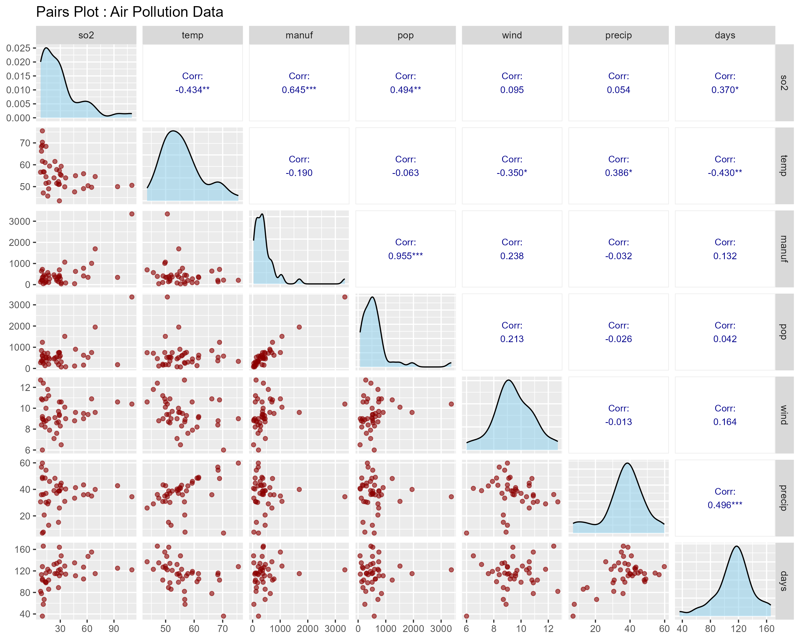
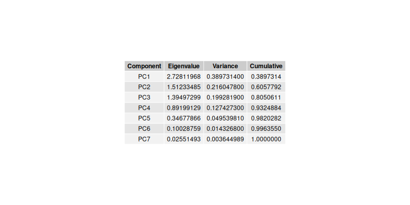
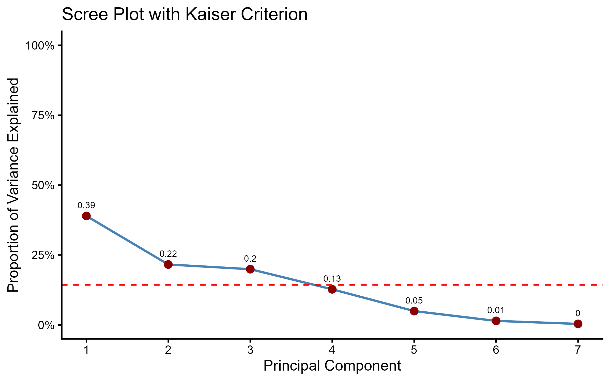
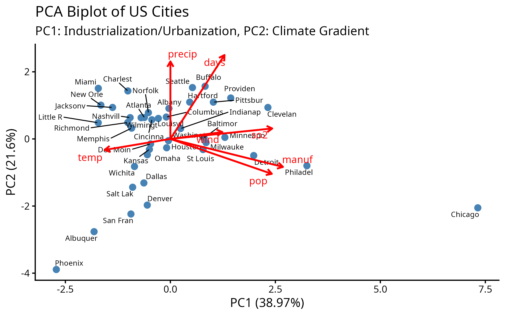
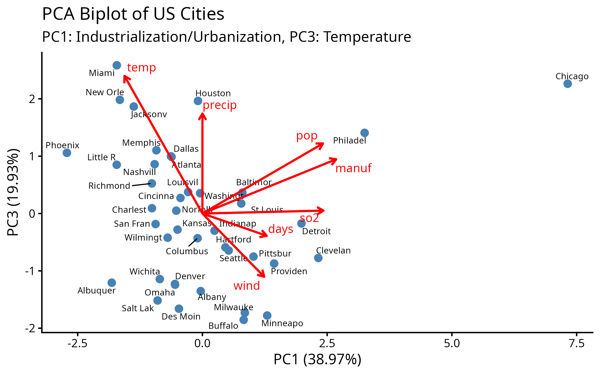
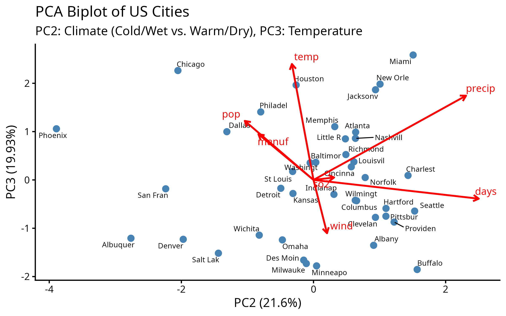
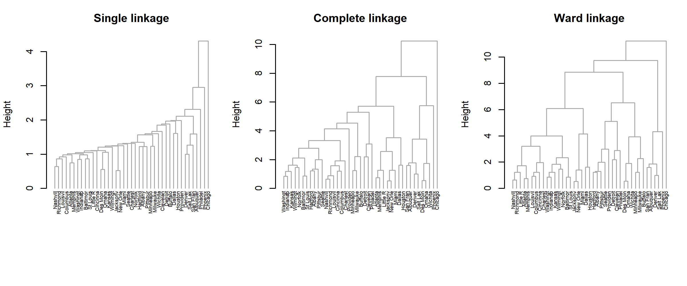
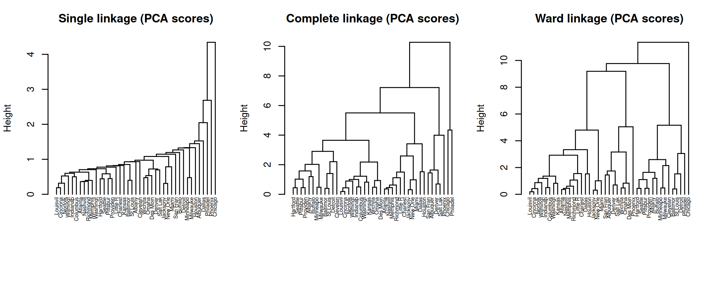

# Abstract

***Master's Question:*** *You will write this section LAST. A good abstract is a concise summary of the entire report: the research question, the methods used, the main findings, and the conclusion. Why is it impossible to write a good abstract before the analysis is complete?*

---

# 1. Introduction

Introduction
In the current days, the air quality has become a big problem worldwide. Especially in the cities, air pollution has become a significant public health concern.
As urban areas continue to expand and industrial activities intensify, the concentration of harmful pollutants in the atmosphere has increased dramatically. Pollutants like carbon monoxide, ozone and sulphur dioxide, can have severe impact not only on the environment but also on human health, contributing to respiratory diseases and cardiovascular problems, amongst others. These health complications that shorten life expectancy exist in both economically developing and developed countries.
Moreover, climate change has further aggravated air quality issues, with heat waves and changing weather patterns that create conditions that favour the accumulation of pollutants. As a result, governments, scientists, researchers and environmental organisations are increasingly focused on monitoring air quality and developing strategies to reduce emissions.
Due to the reasons mentioned before, this project aims to analyse a dataset of 41 US cities to identify underlying patterns and relationships between pollution levels, climatic conditions, and demographic or industrial factors.
Making a preliminary analysis of the data, conducting a principal component analysis and conducting a cluster analysis are different types of analytical approaches that can help researchers better understand the complexity of air pollution. These techniques allow the identification of hidden patterns, the reduction of data dimensionality and the grouping of the variables that most contribute to the pollution. By applying these statistical methods, it becomes possible to distinguish the main factors that contribute to poor air quality, detect pollution hotspots and assess how different pollutants interact with each other. Ultimately, these analyses provide valuable insights that support policy development, environmental planning and the creation of targeted interventions aimed at improving air quality and protecting public health.
In this study, we aim to analyse a dataset of 41 US cities from 1970 to identify the primary factors driving air pollution
Using a combination of dimensionality reduction, like Principal Component Analysis (PCA) and clustering techniques like Hierarchical Clustering (HCL),
We aim to uncover which are the main factors that contribute to air pollution, climate contamination, and other population metrics.
The final step of this analysis involves investigating the geographic distribution of these city types to determine if any spatial patterns exist.

Through a preliminary analysis, we can explore the relationships between all the variables and gain an initial understanding of how these factors may influence air pollution.
By applying a principal component analysis (PCA), we aim to reduce the dimensionality of the dataset and determine which combination of variables explain most of the variability in pollution levels.
At the end, using cluster analysis, we can group cities or regions with similar environmental and industrial profiles, allowing us to detect patterns regarding the areas more prone to higher SO2 concentrations.
The Dataset
The analysis is based on a dataset containing seven variables for each of the 41 cities: The Sulphur dioxide content (μg/m³) (SO2), the average annual temperature (°F) (Temp), the number of manufacturing enterprises (Manuf), Population size (in thousands) (Pop), the average annual wind speed (mph) (Wind), the average annual precipitation (inches) (Precip), and the average number of days with precipitation (Days).

---

# 2. Preliminary Data Analysis & Pre-Processing

## 2.1. Descriptive Statistics

A preliminary review of the data reveals significant differences in the scale and distribution of the variables.
As we can see in _**Table 1**_

| Variable | Mean | Std. Dev. | Median | Min   | Max    |
|----------|------|-----------|--------|-------|--------|
|**so2**   | 30.05| 23.47227  | 26.00  | 8.0   | 110.00 |
|**temp**  | 55.76| 7.227716  | 54.60  | 43.50 | 75.50  |
|**manuf** | 463.1| 563.4739  | 347.0  | 35.0  | 3344.0 |
|**pop**   | 608.6| 579.113   | 515.0  | 71.0  | 3369.0 |
|**wind**  | 9.444| 1.428644  | 9.300  | 6.000 | 12.700 |
|**precip**| 36.77| 11.77155  | 38.74  | 7.05  | 59.80  |
|**days**  | 113.9| 26.50642  | 115.0  | 36.0  | 166.0  |

Table 1: Summary of the main statistics in our dataset


Table 1 reveals that the variables are not on a comparable scale.
The standard deviation of `Pop` and `manuf` are orders of magnitude larger than that the other variables like `Wind`, or `precip`.
Furthermore, `Pop` and `Manuf` exhibit significant right-skew, with means that they are larger than their medians.

This observations are the first step to guide our analisys, because performing Principal Component Analysis on raw, unscaled data of this nature would lead to a completely invalid result.
The first principal component would be overwhelmingly dominated by the variables with the largest variance, that in our case are `Pop` and `Manuf`  ignoring the contributions of
other variables more directly related with the climate, like precip and wind variables.

Therefore, **all variables must be standardized (scaled to have a mean of 0 and a standard deviation of 1) before analysis.**
This ensures that each variable contributes to the analysis based on its correlation with other variables, not based on the meassure scale.
To achive this we used the **correlation matrix** for PCA instead of the **covariance matrix**.

ok

# Pairs Plot.


`[Placeholder for Correlation Matrix Plot]`

The correlation structure reveals two dominant patterns. First, there is a near-perfect linear relationship between `Pop` and `Manuf` (r = 0.96), indicating
that for these 1970s cities, population scale and industrial base were almost interchangeable.
This suggests a socioeconomic structure centered around industrial employment, likely reflecting the tail end of the post-war manufacturing boom and urbanization trends.

Second, a significant moderate positive correlation exists between `Manuf` and `SO2` (r = 0.65).
This provides statistical evidence for the hypothesis that industrial activity is a primary driver of sulfur dioxide pollution.
The fact that the correlation is not near-perfect suggests that while manufacturing is a key factor, other
variables (such as climate conditions or the specific type of industry) also play a role in mediating pollution levels.
Weaker, secondary correlations are also noted between climate variables (`Precip` and `Days`) and between population and pollution (`Pop` and `SO2`).

# 3. Principal Component Analysis (PCA)

## 3.1. Determining the Number of Components

To reduce the dimensionality of the dataset from 7 variables to a smaller, more interpretable set of components, we evaluated three criteria:

1.  **Kaiser's Criterion**: Retain components with eigenvalues greater than 1.
2.  **Scree Plot**: Identify the "elbow point" where the variance explained by subsequent components sharply decreases.
3.  **Cumulative Variance**: Ensure a sufficient percentage (typically >70-80%) of the total variance is explained.

| Component | Eigenvalue | Variance Explained (%) | Cumulative Variance (%) |
|-----------|------------|------------------------|-------------------------|
| PC1       | 2.72811968 | 0.3897314              |       0.3897314         |
| PC2       | 1.51233485 | 0.2160478              |       0.6057792         |
| PC3       | 1.39497299 | 0.1992819              |       0.8050611         |
| PC4       | 0.89199129 | 0.1274273              |       0.9324884         |
| PC5       | 0.34677866 | 0.04953981             |       0.98202821        |
| PC6       | 0.10028759 | 0.0143268              |       0.9963550         |
| PC7       | 0.02551493 | 0.003644989            |       1.0000000         |

```{r, echo=FALSE }
library(gridExtra)
library(grid)
library(ggplot2)

# Crear la tabla como data frame
pca_table <- data.frame(
  Component = paste0("PC", 1:7),
  Eigenvalue = c(2.72811968, 1.51233485, 1.39497299, 0.89199129, 0.34677866, 0.10028759, 0.02551493),
  Variance = c(0.3897314, 0.2160478, 0.1992819, 0.1274273, 0.04953981, 0.0143268, 0.003644989),
  Cumulative = c(0.3897314, 0.6057792, 0.8050611, 0.9324884, 0.98202821, 0.9963550, 1.0000000)
)

# Crear tabla visual
table_plot <- tableGrob(
  pca_table,
  rows = NULL,
  theme = ttheme_default(
    core = list(fg_params = list(hjust = 0.5, x = 0.5)),
    colhead = list(fg_params = list(fontface = "bold", hjust = 0.5))
  )
)

# Exportar como PNG
if(!dir.exists("./Multivariate_Data_Analysis_Project/plots")) dir.create("./Multivariate_Data_Analysis_Project/plots")
png("./Multivariate_Data_Analysis_Project/plots/pca_table.png", width = 800, height = 400)
grid.draw(table_plot)
dev.off()

```


```{r, echo=FALSE}
library(knitr)
library(kableExtra)

kable(pca_table, format = "html", digits = 4, align = "c",
      col.names = c("Component", "Eigenvalue", "Variance Explained (%)", "Cumulative Variance (%)")) %>%
  kable_styling(full_width = FALSE, position = "center", bootstrap_options = c("striped", "hover"))

```



Based on a convergence of these criteria, the selection of **3 principal components** is the most statistically robust choice.

While the scree plot showed a primary "elbow" after the second component, the third component's eigenvalue (1.39) is well above the Kaiser criterion threshold of 1.0.
More importantly, retaining only two components would explain a mere 60.6% of the total variance, discarding almost 40% of the information in the dataset.
The inclusion of PC3 increases the cumulative variance explained to a much more acceptable 80.5%.
This demonstrates that PC3 describes, significantly our data. We therefore proceed with a 3-component solution.

## 3.2. Interpreting the Principal Components

The retained principal components represent new, uncorrelated axes that capture the main directions of variation in the data.
Their meanings are derived from the variable loadings.

| Component |      Comp.1     |     Comp.2    |     Comp.3    |
|-----------|-----------------|---------------|---------------|
|   so2     |   0.8088365434  |   0.10400859  |   0.01694887  |
|   temp    |  -0.5208984175  |  -0.10900423  |   0.79975860  |
|   manuf   |   0.8938494595  |  -0.27778184  |   0.31553891  |
|   pop     |   0.8053502866  |  -0.34679989  |   0.40728458  |
|   wind    |   0.4127189331  |   0.06821718  |  -0.36763244  |
|   precip  |   0.0003093839  |   0.76968782  |   0.58113903  |
|   days    |   0.4297383099  |   0.83374415  |  -0.12942257  |

*(Your table of PC Loadings goes here.)*

**PC1: "Industrial & Urban Scale" (Loadings: `manuf`, `pop`, `so2`)**
This component confirms the hypothesis from our preliminary analysis.
Strong positive loadings for `manuf` (0.89), `pop` (0.81), and `so2` (0.81)
show that these three variables move together.
This axis represents the primary source of variation in the dataset:
the difference between large, dense, industrial cities and their smaller,
less industrial counterparts.

**PC2: "Precipitation Level" (Loadings: `days`, `precip`)**
This is a pure climate component, overwhelmingly defined by high positive
loadings for `days` (0.83) and `precip` (0.77).
It is a clean axis that distinguishes wet, humid cities with many days of
precipitation from dry, arid ones. It is notably independent
of temperature, which has a negligible loading on this component.

**PC3: "Temperature & Coastal Factor" (Loadings: `temp`, `precip`)**
This component is primarily a **Temperature** axis, with a dominant
positive loading for `temp` (0.80).
It also shows a moderate positive loading for `precip` (0.58).
This suggests it captures a more nuanced climate profile than PC2 alone,
likely distinguishing hot, humid cities
(typical of southern or coastal regions) from colder, drier ones.


(a)

(b)

(c)

***Master's Question:*** *How do these additional biplots (PC1 vs PC3, PC2 vs PC3) and the 3D plot
enhance or refine your understanding of the component interpretations? Do they reveal any relationships
or separations not clear from the PC1 vs PC2 biplot alone?*

Figure 4 shows three biplots (PC1 vs PC2, PC1 vs PC3, PC2 vs PC3) with variable loadings.
Variable vectors originate at the origin; their direction indicates correlation with the components
and their length indicates the strength of the contribution.
In panel (a) the small angle between manuf and pop confirms their strong positive correlation and their dominant contribution to PC1.
grafic (b) and (c) reveal additional structure: PC3 captures variance not visible in PC1–PC2 and clarifies relationships such as the (near) negative
alignment of temp and wind

The figure 4 a) PC1 vs PC2, shows some outliers, there are some cities like chicago, that in the x axis
has a value of 7.5 position as an outlier. In the context of our PC1 identified as Industrial and Urbanization.
Chicago, was a big metropolitan area with an important industrial center in 1970. Followed by Philadelphia as
the seconde most important and inudstrial city, explained by the PC1. On the other hand, cities, like albuquer, phoenix and
San Francsto show a negative socre regarding the PC1 and PC2 which menas a low value in pop, manuf and precp and days
respectively. This negative correlation, means that in the 1970
this cities, where less populated, and smaller cities, with less industrial complex and impact.

Other important cities in this case for the PC2 where Miami, Charles, Norflok and Buffalo. Their score regarding
the PC1 was negative, implitying that these cities were less populated and with a low industrial complex.
However, their high score in PC2 near 2, means a hight value of precp and days in 1970.

The figure 4 b) PC1 vs PC3 regarding the PC3 Temperature, we have a positve score close to 3, for cities
like Miami, being this one of the main outliers for PC3. Followed by Chicago,New Orleans and Houston.
Based on this a high value in PC3 scores means high temp and precip. There is notorius difference between
the weather of Miami, New Orleans, Houston and Chicago, the difference in their climates make strange
that all of them share a strong score in the PC3. It seems to be a contradiction
that can be explained due to the fact of the other two more important variables of the PC3, taht are
manuf (0.32) and pop (0.41). Chicago is and Outlier as we saw in part b) which means have high population and manufacturing.
So it's a 'Hot, Wet, and Densely Populated' city.

Other cities like Minneapo, Buffalo and
Albuquer, have a strong negative scores, close to -2. This means low temp and precip. But we spot that Abuquerquer
is one of the hotter cities due to the fact that is a desert, having lower precip levels which is the second
most relevant variable in the PC3. Bufalo and Mineapo are indeed cooler cities, which corroborates the low temp.

figure 4 c) PC2 vs PC3. This grphics display insighfull information, regarding the climate profiles
of the cities, independent of dominant urban and industrial scale comming from PC1. Based ont their climate
alone we found cities like Miami, New Orleands and Jackson in the 1970s were hot and wet cities, which make sense
being Miami the city that present higher scores, in PC2 and PC3, in both due to his tropical, climate.
and we can start to make some grups, like Hot & Wet (High PC3, High PC2).
Other important groups, that we can make are Cold & Wet: (Low PC3, High PC2) and
Cities like bufalo and Albany, Other important group that we can conform is Hot & Dry cities, that have High PC3, Low PC2.
In this group the most representative city is Phoenix. Nevertheless, the last
group formed was Cold and Dry cities, with low PC2 and PC3. In this group we have cities, like
Albuquerquer, Denver, Salt lake city that are more desertic and very dry areas.

The figure 5, we have a 3D view of our observations, in the three new axis PC1, PC2, and PC3.
and summarize all that we have identified with our 3 principal components and also how each component is affected by the 7 variables, with this information
we can start to make correlations, or groups of cityes, based on the 3 pc scores as we saw in the figure 4 c).
Because each observation has different characteristics, and using the scores that asjust our
observations, to the new PCs components axis will help us to group them, and start to find patterns.
Also understanding the loadings we identify some characteristic that will lead us to make new groups or clusters.

For the cluster analisys, we can use the scores, that we found for this three PCs,
however we can also use the 7 variables. But the first option, offers a more robust
analisis because already remove the noise asociated with variables that are deeply
correlated or that at the end will explain the same phenomena like pop and manuf so
grouping them will let us discover more data that can be leopardize for this two
variables. Another reason is that we can group and cluster the observations, using their
weather, as we have two components that are strongly correlated with the climate changes
of the observations. So using the scores, we can already start to separate the groups of
variables, and with the loadings as we saw before the variables with a close angle
between them tend to explain the same phenomena. But we will use both approach the 7
variables and the cluster analisys to compare them.

---

# 4. Comprehensive and Comparative Cluster Analysis

In this section, we undertake a rigorous, multi-stage comparison of clustering methodologies to identify the most robust and interpretable grouping of the 41 US cities. O
our goal is not just to apply a single method, but to understand and justify our choices at each step.

## 4.2. Hierarchical Clustering Exploration

Hierarchical clustering builds a nested hierarchy of clusters, visualized as a dendrogram.
The structure of this tree is highly dependent on the chosen distance metric and linkage criterion.

### 4.2.1. Distance Metric

### Distance metric for PCA.
The first step is to calculate a distance matrix between all pairs of cities.
Given our continuous, standardized variables, the **Euclidean distance** is the most common
and intuitive choice, representing the straight-line distance between two points in n-dimensional space.


### Distance metric for Original Variables.

In order to find the optimal distance between our original 7 variables, and observations, we will use the euclidian distance for the reasons
mention before, however in this case we will need to perform a data standarization, because our variables, are in different units.
Another fundament for this choice was that we can compare clustering with (Euclidean on Raw Standardized Data) vs. (Euclidean on PC Scores).

We explicity aknowledge of the limitations of the eucledian distance for the dataset provided, as there are some variables, that show strong correlation as is show in the
pair plot, like **manuf** and **pop**. However, using it allows for a direct comparison that will help us to confirm the superiority of the PCA-based method

Nevertheless, the usage of other distance like Mahalanobis, which use the covariance matrix as the core of its calculation to correct this problems, is notoriously
sensitive to outliers. Extreme observations like Chicago, or Phoenix will affect the calculation. For this reason we disscard it, and we will
move forward with the eucledian distance for standarized data.

### 4.2.2. Hierarchical Linkage Comparison

### (on PC Scores and PC raw data))

Having established that PC scores are the superior input data, we now explore which hierarchical linkage criterion is best. The linkage criterion defines how the distance between clusters is measured. We will compare the four primary methods.




***Master's Question:*** *Create a summary table comparing the four linkage methods based on the PC scores.
The table should include two key metrics: the **Agglomerative Coefficient (AC)**, which measures the strength of the clustering
structure, and the **Cophenetic Correlation Coefficient**, which measures how well the dendrogram preserves the original pairwise distances.
Higher values are better for both. Which method performs best based on these quantitative measures?*

# 4. Comprehensive and Comparative Cluster Analysis

To identify the most meaningful and statistically sound grouping of cities, we will perform a comparative analysis to justify our final choice. This involves two main lines of inquiry:
1.  **Input Data**: Does clustering on the decorrelated Principal Component (PC) scores produce more robust and interpretable clusters than clustering on the original, correlated variables?
2.  **Algorithm & Parameters**: Within a given approach, which algorithm (e.g., Hierarchical vs. K-Means) and which parameters (e.g., linkage method, number of clusters `k`) are most appropriate for this dataset?

This section follows that logic, first exploring the input data question and then diving deep into algorithm selection to arrive at a final, defensible model.

## 4.1. The Naive Approach: Clustering on Original Variables

A direct approach to clustering is to use the original 7 standardized variables. However, as established in our preliminary analysis, this data suffers from high multicollinearity (e.g., `manuf` and `pop`). Clustering methods that rely on distance calculations, like hierarchical clustering with Euclidean distance, are sensitive to this. Correlated variables are implicitly "over-weighted," which can distort the resulting clusters, biasing them towards the redundant dimension.

To demonstrate this, we will first perform a hierarchical cluster analysis using four different linkage methods on the 7 standardized variables.

`[Placeholder for 2x2 Grid of Dendrograms from clustering on 7 original standardized variables (Ward.D2, Complete, Average, Single)]`

***Master's Question:*** *Create a summary table comparing the four linkage methods based on the Raw Data.
The table should include two key metrics: the **Agglomerative Coefficient (AC)**, which measures the strength of the
clustering structure, and the **Cophenetic Correlation Coefficient**, which measures how well the dendrogram preserves the original pairwise distances.
Higher values are better for both. Which method performs best based on these quantitative measures?*

|      Method      | Agglomerative Coefficient (AC) | Cophenetic Correlation Coefficient |
|------------------|--------------------------------|------------------------------------|
| Single Linkage   |        0.7033724               |             0.8533611              |
| Complete Linkage |        0.8376211               |             0.6873652              |
| Ward.D2          |        0.8552635               |             0.4697547              |

***Master's Questions:***
1.  *Visually compare the four dendrograms. Which methods produce the most balanced, interpretable trees? Which produce messy or "chained" results (where individual observations are added to a single large cluster one by one)?*
2.  *Briefly discuss the theoretical properties that explain these visual differences. Why does **Single linkage** often lead to chaining? Why does **Ward's method**, which seeks to minimize within-cluster variance, typically produce clean, well-separated clusters?*
3.  *Based on both the visual results and theory, justify your selection of a **champion linkage method** (e.g., Ward's method) for this naive approach, which will be used for comparison in Section 4.5.*

## 4.2. The Robust Approach: Clustering on Principal Components

To overcome the limitations of the naive approach, we now cluster on the **3 retained PC scores**. This is a statistically more robust method for two reasons:
1.  **Decorrelation**: The PC scores are, by definition, uncorrelated. This eliminates the problem of multicollinearity and variable "over-weighting." Each component represents a distinct, orthogonal dimension of variation.
2.  **Denoising**: By using only the first 3 PCs, we are focusing on the most significant patterns in the data (80.5% of the variance) and filtering out the "noise" contained in the minor components.

### 4.2.1. Distance Metric Discussion

For both the naive and robust approaches, we must select a distance metric. Given our continuous, standardized data (either original variables or PC scores), **Euclidean distance** is the standard and intuitive choice. It represents the straight-line distance between two points in n-dimensional space.

This choice is strategic. For our **Robust Approach**, using Euclidean distance on the uncorrelated, noise-reduced PC scores is the standard and most intuitive method.

For our **Naive Approach**, we will also use Euclidean distance on the 7 original, standardized variables. We explicitly acknowledge this approach is flawed: Euclidean distance does not account for the high correlation between variables like `manuf` and `pop`, which will distort the clusters. However, using it allows for a direct and powerful comparison that will demonstrate the superiority of the PCA-based method.

*(A note on alternatives: While **Mahalanobis distance** is designed to handle correlation, it is notoriously sensitive to the influence of outliers on the covariance matrix. Given the presence of extreme outliers like Chicago in our data, this method was deemed less robust than the PCA-based approach for this specific analysis.)*

### 4.2.2. Hierarchical Linkage Comparison (on PC Scores)

Having established that PC scores are the superior input data, we now explore which hierarchical linkage criterion is best. The linkage criterion defines how the distance between clusters is measured. We will compare the four primary methods.

`[Placeholder for 2x2 Grid of Dendrograms, showing results for Ward.D2, Complete, Average, and Single linkage on the 3 PC Scores]`

***Master's Question:*** *Create a summary table comparing the four linkage methods based on the PC scores. The table should include two key metrics: the **Agglomerative Coefficient (AC)**, which measures the strength of the clustering structure, and the **Cophenetic Correlation Coefficient**, which measures how well the dendrogram preserves the original pairwise distances. Higher values are better for both. Which method performs best based on these quantitative measures?*

|      Method      | Agglomerative Coefficient (AC) | Cophenetic Correlation Coefficient |
|------------------|--------------------------------|------------------------------------|
| Single Linkage   |        0.8118718               |        0.8529945                   |
| Complete Linkage |        0.9007324               |        0.7569114                   |
| Ward.D2          |        0.8958177               |        0.4519069                   |

The decision is a result of doing a tradeoff analysis. Single Linkage, while exhibiting the highest Cophenetic Correlation (0.8534), was discarded. Visually, it produces
a heavily "chained" and uninterpretable structure, likely by following the path of least resistance along the strong pop/manuf correlation.
Its low Agglomerative Coefficient (0.7034) confirms it fails to find a strong clustering structure. Although Ward's method, conversely, produces a
visually clean cluster, figure 6, and has a high Agglomerative Coefficient (0.8553) and (0.8530) for raw data and PCA scores, respectively.
However, this is achieved at the cost of a significantly lower Cophenetic Correlation (0.4698) and (0.4519) for raw
data and PCA scores, respectively, indicating that the dendrogram is a poor, distorted representation of the true pairwise distances.
Complete Linkage, therefore, offers the best balance. It achieves a high Agglomerative Coefficient in both cases, raw data
and PCA scores (0.8376 - 0.9007), comparable to or even exceeding Ward's method, while maintaining a much higher Cophenetic Correlation.
It successfully identifies a strong, compact clustering structure without excessively distorting
the underlying data, making it the most reliable and defensible choice.

## 4.3. Determining the Optimal Number of Clusters (k)

After selecting a champion linkage criterion (e.g., Ward's method) for the robust approach, we now proceed to Stage 2: determining the optimal number of clusters, `k`, for this specific method. While visual inspection of the dendrogram can be suggestive, we will use robust quantitative methods to make a defensible choice. We will use the "Average Silhouette" method and the "Gap Statistic" on the results from the chosen hierarchical clustering method.

`[Placeholder for Average Silhouette Score Plot vs. k for Champion Method (e.g., Ward's)]`
`[Placeholder for Gap Statistic Plot vs. k for Champion Method (e.g., Ward's)]`

  The three methods for determining the optimal number of clusters provide conflicting initial results. The Elbow method is ambiguous, suggesting either 2 or 3 clusters. The Average
  Silhouette method, which prioritizes clean separation, peaks at `k=2`. In contrast, the Gap Statistic, which is the most statistically robust of the three methods, clearly identifies an
  optimal structure at `k=3`.

  This disagreement is itself insightful. It suggests that while the data has a primary split into two major groups (hence the `k=2` result from the Silhouette method), there is a
  statistically significant third cluster that is distinct enough to be identified by the Gap Statistic. We therefore defer to the most robust method.

  Based on the clear peak in the Gap Statistic plot, we will proceed with k=3 for our analysis.

## 4.4. Alternative: Partitioning with K-Means

As a counterpoint to the hierarchical approach, we also run a K-Means analysis, using the value of `k` we just determined to be optimal. This will allow us to compare the results of two different algorithmic families (hierarchical vs. partitioning) to see if they converge on a similar solution.

`[Placeholder for PCA biplot colored by the final K-Means clusters using the chosen k]`

***Master's Question:*** *Qualitatively, how do these clusters appear on the PCA plot compared to the partitions suggested by the Ward's method dendrogram? Do they seem to capture the structure of the data effectively?*

## 4.5. Final Model Selection: The Storyteller's Choice

We now have results from three key approaches:
1.  **Naive Hierarchical:** The champion linkage method on 7 original variables.
2.  **Robust Hierarchical:** The champion linkage method on 3 PC scores with an optimal `k`.
3.  **Robust Partitioning:** K-Means on 3 PC scores with the same optimal `k`.

The final step is to select the single best model to define our city "archetypes."

***Master's Questions:***
1.  **The Core Comparison:** Directly compare the cluster assignments from the **Naive Hierarchical** model and the **Robust Hierarchical** model. The `table()` function in R is excellent for this. Do the two methods group the cities in the same way? Identify a few specific cities that are grouped differently. Can you explain *why* they were grouped differently by referencing the variable loadings of the PCs? (e.g., "The naive method grouped City X with the industrial cluster due to its high `manuf` score, but the PCA method grouped it with the clean cities because its `manuf` score was offset by other factors captured in PC2 and PC3.") This is the most critical part of your analysis.
2.  **Finalist Comparison:** Now compare your two best models: Robust Hierarchical (the champion method) and Robust Partitioning (K-Means). How similar are their assignments?
3.  **Justify Your Champion:** State which final set of clusters you believe is most insightful and defensible. Consider interpretability, statistical justification, and the theoretical advantages of the algorithm. This will be your **final chosen model** for the rest of the report.

---

# 5. Synthesis: Visualizing and Mapping the Final City Archetypes

Now we proceed using the **final chosen clustering model** from the comprehensive
analysis in Section 4.

## 5.1. Visualizing Cluster Separation in PCA Space

Overlaying the final cluster assignments onto the PCA biplot should confirm that the clusters separate cleanly along the principal component axes.

`[Placeholder for PCA Biplot colored by the Final Chosen Clusters]`

***Master's Question:*** *How do your final clusters align with the PC1, PC2, and PC3 axes? For example, does your 'Industrial' cluster have high PC1 scores? Does your 'Cold & Wet' cluster have low PC3 and high PC2 scores? Explain the connection for each cluster.*

## 5.2. Visualizing Cluster Separation on Original Variables

A robust cluster solution must also show meaningful separation when plotted against the original, most influential variables. This serves as a critical validation of our findings.

`[Placeholder for Manuf vs. SO2 Scatter Plot, colored by the Final Chosen Clusters]`

`[Placeholder for Temp vs. Precip Scatter Plot, colored by the Final Chosen Clusters]`

***Master's Question:*** *Do these plots confirm the identity of your chosen clusters? For example, in the `Manuf` vs. `SO2` plot, do the cities you labeled "Industrial" clearly separate with high values on both axes? What do these visualizations tell you that the table of means alone could not?*

## 5.3. Geographic Analysis

The final step is to investigate if these statistically-derived clusters correspond to a geographic reality.

### 5.3.1. Spatial Distribution of City Clusters

`[Placeholder for US Map with cities colored by the Final Chosen Clusters]`

### 5.3.2. Discussion of Geographic Patterns

***Master's Questions:***
1.  *Describe the geographic patterns you observe. Are the clusters randomly scattered, or are they concentrated in specific regions of the United States?*
2.  *For example, where are your "Industrial Metropolis" clusters located? Does it align with your domain knowledge of US economic history (e.g., the Rust Belt)?*
3.  *Where are the "Hot & Dry" cities? Where are the "Cold & Wet" ones? Is there a clear coastal or inland pattern?*

---

# 6. Modeling the Drivers of Pollution

While PCA and clustering identify patterns, they do not constitute a formal statistical model of the relationships between variables. To move from description to inference, we will construct a multiple linear regression model to identify the significant predictors of SO2 pollution.

## 6.1. Model Specification & Multicollinearity

Our objective is to model `SO2` as a function of the other variables. A naive model would be:
`SO2 ~ Temp + Manuf + Pop + Wind + Precip + Days`

However, the preliminary analysis revealed a near-perfect correlation between `Manuf` and `Pop` (r > 0.95). Including both variables in the model is a textbook case of **multicollinearity**, which inflates the variance of the coefficient estimates, making them unstable and untrustworthy.

To mitigate this, we will specify a model that removes the redundant `Pop` variable:
**`SO2 ~ Temp + Manuf + Wind + Precip + Days`**

***Master's Question:*** *Why is it preferable to remove `Pop` instead of `Manuf`? Think about the causal relationship with `SO2`. Which is more likely to be a direct cause of industrial pollution?*

## 6.2. Regression Results

*(Your Regression Summary Table (like from `summary(lm_model)`) goes here.)*

***Master's Questions:***
1.  *Report the model's overall significance (F-statistic) and goodness-of-fit (Adjusted R-squared). Is the model useful?*
2.  *Which individual predictors are statistically significant (p < 0.05)?*
3.  *Interpret the coefficient for the `Manuf` variable. For every one-unit increase in the standardized `Manuf` score, what is the expected change in the standardized `SO2` score, holding all other variables constant?*
4.  *Are there any surprising results? For instance, is `Wind` a significant predictor? What would a negative coefficient for `Wind` imply?*

## 6.3. Model Diagnostics

A model is only as good as its assumptions.

`[Placeholder for Residual Plots: Residuals vs. Fitted, and Q-Q Plot]`

***Master's Questions:***
1.  *Based on the 'Residuals vs. Fitted' plot, does the assumption of linearity and homoscedasticity (equal variance of residuals) appear to hold? Are there any obvious patterns?*
2.  *Based on the 'Normal Q-Q' plot, do the residuals appear to follow a normal distribution?*
3.  *In summary, are there any major violations of the linear regression assumptions?*

---

# 7. Conclusion

***Master's Questions:***
1.  *In 2-3 sentences, what were the one or two most important factors that explain the variation between these 41 US cities? (Hint: Look at your PCA).*
2.  *In bullet points, list the city "archetypes" (your clusters) you discovered and their defining characteristics.*
3.  *What is your single most important finding from the geographic analysis?*
4.  *Based on your regression model, what are the most significant drivers of SO2 pollution? How does this confirm or complement your PCA findings?*
5.  *If a city planner from 1970 read this report, what is one practical insight they could take away?*

---

# 8. Bibliography

*(List any R packages or literature cited.)*
